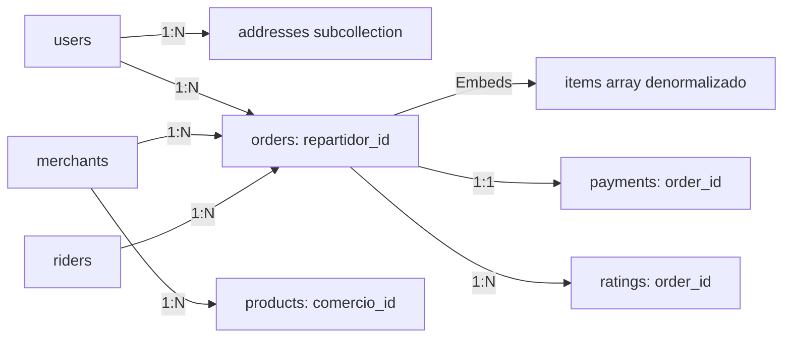
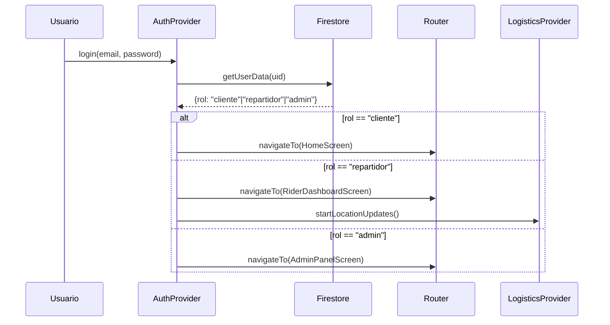

# 🟠🔴 Promt - RAPPI CARLOS
> **Documento Maestro de Arquitectura** | ID Proyecto: `rappi-carlos` | Org: `cbtis128.edu.mx`  
> **Rol:** Lead Software Architect & Staff Engineer  
> **Stack:** Flutter/Dart • Firebase • Clean Architecture • MultiProvider  
> **Estado:** ✅ Aprobado para Fase de Codificación

---

## 📐 1. ARQUITECTURA DE CARPETAS (ESTÁNDAR PROFESIONAL)
Estructura **Clean Architecture orientada a Features** con separación estricta de responsabilidades. Compatible con VS Code y Antigravity.

```text
lib/
├── main.dart                          # Entry point: inicialización de DI, Firebase, Providers
├── core/                              # 🔧 Núcleo transversal (sin dependencia de features)
│   ├── constants/
│   │   ├── app_constants.dart         # URLs, timeouts, límites de la app
│   │   ├── firestore_constants.dart   # Nombres de colecciones y campos
│   │   └── role_constants.dart        # Roles: cliente, repartidor, admin
│   ├── theme/
│   │   ├── app_colors.dart            # Paleta Rappi Spirit (#FF441F, #E30613, #FF007A)
│   │   ├── app_typography.dart        # Estilos de texto escalables
│   │   ├── app_theme.dart             # ThemeData global (light/dark)
│   │   └── app_spacing.dart           # Sistema de espaciado (4px base)
│   ├── utils/
│   │   ├── validators.dart            # Validaciones reutilizables (email, phone, etc.)
│   │   ├── formatters.dart            # Formato de moneda, fecha, distancia
│   │   ├── geo_utils.dart             # Cálculo de distancias Haversine
│   │   └── logger.dart                # Wrapper para debug/logs estructurados
│   ├── errors/
│   │   ├── failures.dart              # Clases base: Failure, ServerFailure, LocalFailure
│   │   └── exceptions.dart            # Excepciones tipadas para la capa de dominio
│   └── injection/                     # 🧩 Inyección de Dependencias
│       ├── service_locator.dart       # Configura get_it para inyección global
│       └── injection_container.dart   # Registra repositories, use cases, services
│
├── features/                          # 🧱 Módulos independientes (Feature-First)
│   │
│   ├── auth/                          # 🔐 Autenticación y gestión de sesión
│   │   ├── data/
│   │   │   ├── datasources/
│   │   │   │   ├── auth_remote_data_source.dart  # API calls a Firebase Auth
│   │   │   │   └── user_local_data_source.dart   # SharedPreferences para token/rol
│   │   │   ├── models/
│   │   │   │   ├── usuario_model.dart            # Extiende Usuario del dominio
│   │   │   │   └── auth_response_model.dart
│   │   │   └── repositories/
│   │   │       └── auth_repository_impl.dart     # Implementa AuthRepository
│   │   ├── domain/
│   │   │   ├── entities/
│   │   │   │   ├── usuario.dart                  # Entidad pura (sin dependencia de Firebase)
│   │   │   │   └── rol_usuario.dart              # Enum: cliente, repartidor, admin
│   │   │   ├── repositories/
│   │   │   │   └── auth_repository.dart          # Contrato abstracto
│   │   │   └── usecases/
│   │   │       ├── login_use_case.dart
│   │   │       ├── register_use_case.dart
│   │   │       ├── logout_use_case.dart
│   │   │       └── get_current_user_use_case.dart
│   │   └── presentation/
│   │       ├── providers/
│   │       │   └── auth_provider.dart            # ChangeNotifier con estados de sesión
│   │       ├── screens/
│   │       │   ├── login_screen.dart
│   │       │   ├── register_screen.dart
│   │       │   ├── role_selection_screen.dart    # Post-login: redirección por rol
│   │       │   └── splash_screen.dart
│   │       └── widgets/
│   │           ├── auth_form_field.dart
│   │           └── role_chip_selector.dart
│   │
│   ├── catalog/                       # 🏪 Catálogo de comercios y productos
│   │   ├── data/
│   │   │   ├── datasources/
│   │   │   │   └── catalog_remote_data_source.dart  # Firestore queries
│   │   │   ├── models/
│   │   │   │   ├── comercio_model.dart
│   │   │   │   ├── producto_model.dart
│   │   │   │   └── categoria_producto_model.dart
│   │   │   └── repositories/
│   │   │       └── catalog_repository_impl.dart
│   │   ├── domain/
│   │   │   ├── entities/
│   │   │   │   ├── comercio.dart
│   │   │   │   ├── producto.dart
│   │   │   │   └── categoria_producto.dart
│   │   │   ├── repositories/
│   │   │   │   └── catalog_repository.dart
│   │   │   └── usecases/
│   │   │       ├── get_comercios_activos_use_case.dart
│   │   │       ├── get_productos_by_comercio_use_case.dart
│   │   │       ├── search_productos_use_case.dart
│   │   │       └── get_comercios_nearby_use_case.dart  # Geo-queries
│   │   └── presentation/
│   │       ├── providers/
│   │       │   └── catalog_provider.dart
│   │       ├── screens/
│   │       │   ├── home_screen.dart
│   │       │   ├── commerce_detail_screen.dart
│   │       │   ├── product_list_screen.dart
│   │       │   └── search_screen.dart
│   │       └── widgets/
│   │           ├── commerce_card.dart
│   │           ├── product_tile.dart
│   │           ├── category_filter_chip.dart
│   │           └── rating_stars.dart
│   │
│   ├── cart/                          # 🛒 Carrito de compras
│   │   ├── data/
│   │   │   ├── datasources/
│   │   │   │   └── cart_local_data_source.dart  # Persistencia local (SharedPreferences/Hive)
│   │   │   ├── models/
│   │   │   │   └── cart_item_model.dart
│   │   │   └── repositories/
│   │   │       └── cart_repository_impl.dart
│   │   ├── domain/
│   │   │   ├── entities/
│   │   │   │   ├── cart.dart
│   │   │   │   └── cart_item.dart
│   │   │   ├── repositories/
│   │   │   │   └── cart_repository.dart
│   │   │   └── usecases/
│   │   │       ├── add_to_cart_use_case.dart
│   │   │       ├── remove_from_cart_use_case.dart
│   │   │       ├── update_cart_quantity_use_case.dart
│   │   │       ├── clear_cart_use_case.dart
│   │   │       └── calculate_cart_total_use_case.dart
│   │   └── presentation/
│   │       ├── providers/
│   │       │   └── cart_provider.dart  # Lógica completa del carrito + notificaciones
│   │       ├── screens/
│   │       │   └── cart_screen.dart
│   │       └── widgets/
│   │           ├── cart_item_tile.dart
│   │           ├── cart_summary_card.dart
│   │           └── quantity_stepper.dart
│   │
│   ├── orders/                        # 📦 Gestión de pedidos y tracking
│   │   ├── data/
│   │   │   ├── datasources/
│   │   │   │   └── orders_remote_data_source.dart  # Firestore + Streams en tiempo real
│   │   │   ├── models/
│   │   │   │   ├── pedido_model.dart
│   │   │   │   ├── item_pedido_model.dart
│   │   │   │   └── order_status.dart  # Enum con estados del ciclo de vida
│   │   │   └── repositories/
│   │   │       └── orders_repository_impl.dart
│   │   ├── domain/
│   │   │   ├── entities/
│   │   │   │   ├── pedido.dart
│   │   │   │   ├── item_pedido.dart
│   │   │   │   └── order_status.dart
│   │   │   ├── repositories/
│   │   │   │   └── orders_repository.dart
│   │   │   └── usecases/
│   │   │       ├── create_order_use_case.dart
│   │   │       ├── get_order_by_id_use_case.dart
│   │   │       ├── stream_order_status_use_case.dart  # Stream para tracking en vivo
│   │   │       ├── get_user_orders_use_case.dart
│   │   │       └── cancel_order_use_case.dart
│   │   └── presentation/
│   │       ├── providers/
│   │       │   └── order_provider.dart
│   │       ├── screens/
│   │       │   ├── checkout_screen.dart
│   │       │   ├── order_confirmation_screen.dart
│   │       │   ├── order_tracking_screen.dart  # Mapa en vivo + estados
│   │       │   └── order_history_screen.dart
│   │       └── widgets/
│   │           ├── order_status_timeline.dart
│   │           ├── tracking_map_preview.dart
│   │           └── order_summary_card.dart
│   │
│   ├── profile/                       # 👤 Perfil de usuario y configuración
│   │   ├── data/
│   │   │   ├── datasources/
│   │   │   │   └── profile_remote_data_source.dart
│   │   │   ├── models/
│   │   │   │   ├── direccion_model.dart
│   │   │   │   └── calificacion_model.dart
│   │   │   └── repositories/
│   │   │       └── profile_repository_impl.dart
│   │   ├── domain/
│   │   │   ├── entities/
│   │   │   │   ├── direccion.dart
│   │   │   │   └── calificacion.dart
│   │   │   ├── repositories/
│   │   │   │   └── profile_repository.dart
│   │   │   └── usecases/
│   │   │       ├── save_address_use_case.dart
│   │   │       ├── get_user_addresses_use_case.dart
│   │   │       ├── update_profile_use_case.dart
│   │   │       └── submit_rating_use_case.dart
│   │   └── presentation/
│   │       ├── providers/
│   │       │   └── profile_provider.dart
│   │       ├── screens/
│   │       │   ├── profile_screen.dart
│   │       │   ├── addresses_screen.dart
│   │       │   └── edit_profile_screen.dart
│   │       └── widgets/
│   │           ├── address_card.dart
│   │           └── rating_dialog.dart
│   │
│   └── logistics/                     # 🚚 Módulo exclusivo para Repartidores
│       ├── data/
│       │   ├── datasources/
│       │   │   └── logistics_remote_data_source.dart  # GeoFire queries + location streams
│       │   ├── models/
│       │   │   └── repartidor_model.dart
│       │   └── repositories/
│       │       └── logistics_repository_impl.dart
│       ├── domain/
│       │   ├── entities/
│       │   │   ├── repartidor.dart
│       │   │   └── delivery_assignment.dart
│       │   ├── repositories/
│       │   │   └── logistics_repository.dart
│       │   └── usecases/
│       │       ├── update_rider_location_use_case.dart  # Stream de coordenadas
│       │       ├── accept_delivery_use_case.dart
│       │       ├── get_nearby_orders_use_case.dart
│       │       └── update_delivery_status_use_case.dart
│       └── presentation/
│           ├── providers/
│           │   └── logistics_provider.dart
│           ├── screens/
│           │   ├── rider_dashboard_screen.dart
│           │   ├── active_delivery_screen.dart  # Mapa + navegación
│           │   └── delivery_history_screen.dart
│           └── widgets/
│               ├── live_location_marker.dart
│               ├── delivery_action_card.dart
│               └── eta_countdown.dart
│
├── shared/                            # 🧩 Componentes transversales y Antigravity-ready
│   ├── widgets/
│   │   ├── buttons/
│   │   │   ├── primary_button.dart
│   │   │   ├── outline_button.dart
│   │   │   └── icon_button.dart
│   │   ├── inputs/
│   │   │   ├── rappi_text_field.dart
│   │   │   ├── rappi_search_field.dart
│   │   │   └── rappi_dropdown.dart
│   │   ├── feedback/
│   │   │   ├── rappi_snackbar.dart
│   │   │   ├── rappi_dialog.dart
│   │   │   ├── loading_overlay.dart
│   │   │   └── empty_state_widget.dart
│   │   ├── cards/
│   │   │   ├── rappi_card.dart
│   │   │   └── shadow_card.dart
│   │   └── maps/
│   │       ├── rappi_map_widget.dart  # Wrapper para google_maps_flutter
│   │       └── location_picker.dart
│   ├── animations/
│   │   ├── lottie_loader.dart
│   │   └── page_transitions.dart
│   └── adapters/
│       └── antigravity_adapter.dart   # Capa de compatibilidad para renderizado en Antigravity
│
└── firebase_options.dart              # Generated by FlutterFire CLI (no editar manualmente)
```

> ✅ **Regla de Oro:** Ninguna carpeta `presentation/` importa directamente de `data/`. Toda comunicación pasa por `domain/` (UseCases + Repositories).

---

## 🗃️ 2. INGENIERÍA DE DATOS: MAPEO SQL → FIRESTORE (11 ENTIDADES)
Estrategia híbrida: **Referencias para datos dinámicos** + **Denormalización controlada para historiales inmutables**.

### 📋 Tabla Maestra de Colecciones

| Entidad SQL | Colección Firestore | ID Strategy | Campos Críticos (Tipos) | Relación / Denormalización |
|-------------|---------------------|-------------|-------------------------|---------------------------|
| **Usuario** | `users` | `uid` (Firebase Auth) | `nombre`, `apellido`, `email`, `telefono`, `rol` (string), `created_at` (timestamp), `is_active` (bool) | Base para todos los roles. `rol` define acceso. |
| **Dirección** | `users/{uid}/addresses` (subcolección) | Auto-ID | `alias`, `calle`, `numero`, `colonia`, `ciudad`, `estado`, `cp`, `lat`, `lng`, `is_default` (bool) | Subcolección para aislamiento por usuario. |
| **Comercio** | `merchants` | Auto-ID | `nombre`, `categoria_id` (ref), `descripcion`, `logo_url`, `cover_url`, `lat`, `lng`, `tiempo_entrega_min`, `costo_envio`, `calificacion_promedio`, `is_active` | Geo-queries con `lat/lng`. `categoria_id` como referencia. |
| **Categoría_Producto** | `product_categories` | Auto-ID | `nombre`, `icono_url`, `orden` (int) | Datos estáticos, baja frecuencia de cambio. |
| **Producto** | `products` | Auto-ID | `comercio_id` (ref), `categoria_id` (ref), `nombre`, `descripcion`, `precio`, `imagen_url`, `stock`, `is_available` | `comercio_id` para filtrar. **No** denormalizar precio aquí. |
| **Repartidor** | `riders` | `uid` (Firebase Auth) | `usuario_id` (ref a `users`), `vehicle_type`, `license_plate`, `is_online`, `current_lat`, `current_lng`, `rating`, `total_deliveries` | `current_lat/lng` actualizado cada 30s para tracking. |
| **Pedido** | `orders` | Auto-ID | `cliente_id` (ref), `comercio_id` (ref), `repartidor_id` (ref?, nullable), `direccion_entrega` (**denormalizado**: objeto completo), `items` (**denormalizado**: array de `Item_Pedido`), `subtotal`, `costo_envio`, `descuento`, `total`, `status` (enum), `created_at`, `updated_at` | 🔥 **Denormalización crítica**: `items` y `direccion_entrega` se copian para que cambios futuros en productos/direcciones no alteren el historial. |
| **Item_Pedido** | *Embedded en `orders.items[]`* | N/A | `producto_id` (ref), `nombre_producto` (copiado), `precio_unitario` (copiado), `cantidad`, `subtotal` | **Nunca** como colección separada. Siempre embebido en el pedido. |
| **Cupón** | `coupons` | Auto-ID | `codigo`, `descripcion`, `tipo_descuento` (`percent`/`fixed`), `valor`, `min_compra`, `max_usos`, `usos_restantes`, `valid_from`, `valid_until`, `is_active` | Validación en Cloud Function para evitar race conditions. |
| **Pago** | `payments` | Auto-ID | `order_id` (ref), `metodo` (`card`, `cash`, `rappicredit`), `status` (`pending`, `approved`, `rejected`, `refunded`), `transaction_id`, `amount`, `currency`, `created_at` | Integración con pasarela externa (Stripe/MercadoPago) vía Cloud Functions. |
| **Calificación** | `ratings` | Auto-ID | `rater_id` (ref), `rated_id` (ref), `order_id` (ref), `tipo` (`comercio`/`repartidor`), `rating` (1-5), `comentario`, `created_at` | Índices compuestos para `rated_id + tipo` para cálculo de promedios. |

### 🔗 Estrategia de Relaciones y Denormalización



#### ✅ Cuándo DENORMALIZAR (copiar datos):
1. **`orders.items[]`**: Copiar `nombre_producto`, `precio_unitario`, `imagen_url`.  
   *Razón:* Si el comercio cambia el precio mañana, el historial del pedido debe reflejar el precio pagado, no el actual.
2. **`orders.direccion_entrega`**: Copiar objeto completo de dirección.  
   *Razón:* El usuario puede editar/borrar direcciones después de realizar un pedido.
3. **`orders.comercio_nombre` y `comercio_logo`**: Para mostrar en historial sin joins.

#### 🔗 Cuándo usar REFERENCIAS (IDs):
1. **`products.comercio_id`**: Para consultar todos los productos de un comercio.
2. **`orders.cliente_id`**: Para historial de pedidos del usuario.
3. **`ratings.rated_id`**: Para calcular promedio de calificaciones de un comercio/repartidor.

### 🗄️ Índices Compuestos Requeridos (Firestore Console)
```javascript
// products: búsqueda por comercio + disponibilidad
products: [comercio_id ASC, is_available DESC, nombre ASC]

// orders: historial de usuario + estado
orders: [cliente_id ASC, created_at DESC, status ASC]

// riders: repartidores online por proximidad (GeoFire)
riders: [is_online DESC, _geohash ASC] // Requiere librería geoflutterfire2

// ratings: promedio por entidad
ratings: [rated_id ASC, tipo ASC, rating ASC]
```

---

## ⚙️ 3. LÓGICA DE NEGOCIO Y FLUJOS (WORKFLOW)

### 🔐 Sistema de Roles: Flujo Post-Login


### 📦 Ciclo de Vida del Pedido (Estados Exactos)
```dart
// features/orders/domain/entities/order_status.dart
enum OrderStatus {
  pending,        // ✅ Pedido creado, esperando confirmación del comercio
  confirmed,      // ✅ Comercio aceptó, preparando productos
  ready,          // ✅ Listo para recoger, esperando repartidor
  assigned,       // ✅ Repartidor asignado, en camino al comercio
  picked_up,      // ✅ Repartidor recogió, en camino al cliente
  in_route,       // ✅ En ruta de entrega (actualización GPS activa)
  delivered,      // ✅ Entregado exitosamente (finalizado)
  cancelled,      // ❌ Cancelado por cliente/comercio
  rejected,       // ❌ Rechazado por comercio (sin stock, etc.)
  refunded        // 💰 Reembolsado (post-entrega con incidencia)
}
```

#### 🔔 Notificación de Cambios de Estado:
1. **Firestore Stream**: `orders/{orderId}.snapshots()` en `OrderTrackingScreen`.
2. **Cloud Functions Trigger**: Al cambiar `status`, dispara:
   - Notificación push al cliente (`firebase_messaging`)
   - Actualización de métricas del comercio
   - Asignación automática de repartidor si `status == ready`
3. **Optimistic UI**: El cliente ve el cambio inmediatamente; si falla, se revierte con `SnackBar` de error.

### 🚚 Módulo de Logística: Tracking en Tiempo Real
```dart
// features/logistics/domain/usecases/update_rider_location_use_case.dart
class UpdateRiderLocationUseCase {
  Future<void> call({
    required String riderId,
    required double lat,
    required double lng,
    required String? orderId, // null si está disponible, no en entrega
  }) async {
    // 1. Actualizar ubicación en riders/{riderId}
    await _firestore.collection('riders').doc(riderId).update({
      'current_lat': lat,
      'current_lng': lng,
      'last_update': FieldValue.serverTimestamp(),
      if (orderId != null) 'active_order_id': orderId,
    });
    
    // 2. Si tiene orden activa, actualizar subcolección para tracking del cliente
    if (orderId != null) {
      await _firestore
          .collection('orders')
          .doc(orderId)
          .collection('tracking')
          .add({
            'lat': lat,
            'lng': lng,
            'timestamp': FieldValue.serverTimestamp(),
            'status': 'in_route',
          });
    }
    
    // 3. GeoFire: actualizar índice geoespacial para búsquedas de proximidad
    await _geoFire.setLocation(riderId, GeoPoint(lat, lng));
  }
}
```

#### 📡 Frecuencia de Actualización:
| Estado del Repartidor | Frecuencia GPS | Precisión Requerida |
|----------------------|----------------|-------------------|
| `is_online: true` (disponible) | Cada 60 segundos | ~50 metros |
| `active_order_id` != null (en entrega) | Cada 15 segundos | ~10 metros |
| `status == picked_up` o `in_route` | Cada 5 segundos + acelerómetro | ~5 metros |

> ⚠️ **Optimización:** Usar `geolocator` con `LocationSettings(accuracy: LocationAccuracy.high, distanceFilter: 10)` solo durante entregas activas para ahorrar batería.

---

## 🛠️ 4. CONFIGURACIÓN TÉCNICA DEL ENTORNO

### 📦 `pubspec.yaml` Maestro (Dependencias Categorizadas)
```yaml
name: rappi_carlos
description: Plataforma de pedidos a domicilio - Proyecto RappiCarlos
version: 1.0.0+1
publish_to: none

environment:
  sdk: '>=3.2.0 <4.0.0'
  flutter: '>=3.16.0'

dependencies:
  flutter:
    sdk: flutter
  flutter_localizations:
    sdk: flutter

  # 🔥 FIREBASE CORE & SERVICIOS
  1. firebase_core: ^2.24.2
  2. firebase_auth: ^4.16.0
  3. cloud_firestore: ^4.14.0
  4. firebase_storage: ^11.6.0          # Para imágenes de perfil/productos
  5. firebase_messaging: ^14.7.10       # Notificaciones push
  6. cloud_functions: ^4.6.0            # Lógica serverless segura

  # 📦 GESTIÓN DE ESTADO & ARQUITECTURA
  7. provider: ^6.1.1                   # MultiProvider + ChangeNotifier
  8. get_it: ^7.6.4                     # Inyección de dependencias (service locator)
  9. equatable: ^2.0.5                  # Comparación de valores para entidades

  # 🌍 GEOLOCALIZACIÓN & MAPAS
  10. geolocator: ^10.1.0               # GPS nativo de alta precisión
  11. google_maps_flutter: ^2.5.3       # Mapas interactivos
  12. geoflutterfire2: ^2.3.10          # Geo-queries en Firestore

  # 🌐 UTILIDADES & UI
  13. intl: ^0.19.0                     # Formato de moneda, fecha, número
  14. cached_network_image: ^3.3.1      # Caché de imágenes con placeholder
  15. uuid: ^4.2.1                      # IDs únicos para carritos/items locales
  16. flutter_slidable: ^3.0.1          # Swipe actions en listas (carrito, pedidos)
  17. lottie: ^2.7.0                    # Animaciones JSON para feedback visual

  # 🔐 SEGURIDAD & PERSISTENCIA LOCAL
  18. flutter_secure_storage: ^9.0.0    # Token de sesión encriptado
  19. shared_preferences: ^2.2.2        # Preferencias simples (tema, idioma)
  20. hive: ^2.2.3                      # Base de datos local para carrito offline

dev_dependencies:
  flutter_test:
    sdk: flutter
  flutter_lints: ^3.0.1
  build_runner: ^2.4.7                  # Para generar código (Hive, JSON)
  mockito: ^5.4.4                       # Testing de repositorios/use cases

flutter:
  uses-material-design: true
  generate: true                        # Para intl (localización)
  
  assets:
    - assets/images/
    - assets/icons/
    - assets/animations/
    - assets/fonts/
    
  fonts:
    - family: Inter
      fonts:
        - asset: assets/fonts/Inter-Regular.ttf
          weight: 400
        - asset: assets/fonts/Inter-Medium.ttf
          weight: 500
        - asset: assets/fonts/Inter-SemiBold.ttf
          weight: 600
        - asset: assets/fonts/Inter-Bold.ttf
          weight: 700
```

### 🧪 Estrategia de Desarrollo: Firebase Emulator Suite
```bash
# 1. Instalar emuladores (una vez)
npm install -g firebase-tools
firebase setup:emulators:ui
firebase setup:emulators:firestore
firebase setup:emulators:auth
firebase setup:emulators:functions

# 2. Configurar firebase.json para desarrollo local
{
  "emulators": {
    "auth": { "port": 9099 },
    "firestore": { "port": 8080 },
    "functions": { "port": 5001 },
    "ui": { "enabled": true, "port": 4000 },
    "hosting": { "port": 5000 }
  },
  "firestore": {
    "rules": "firestore.rules",
    "indexes": "firestore.indexes.json"
  }
}

# 3. Conectar Flutter a emuladores (solo en modo debug)
// lib/core/constants/app_constants.dart
class AppConstants {
  static const bool useEmulators = true; // 🔥 Cambiar a false para producción
  
  static void configureFirebaseEmulators() {
    if (useEmulators && !kReleaseMode) {
      FirebaseAuth.instance.useAuthEmulator('localhost', 9099);
      FirebaseFirestore.instance.useFirestoreEmulator('localhost', 8080);
      // FirebaseFunctions.instance.useFunctionsEmulator('localhost', 5001);
    }
  }
}

# 4. Flujo de trabajo diario:
#    Terminal 1: firebase emulators:start
#    Terminal 2: flutter run -d chrome (o android/emulator)
#    Browser: http://localhost:4000 para UI de emuladores (ver datos, auth, logs)
```

> ✅ **Ventaja:** Pruebas sin costo, sin datos reales, reset instantáneo con `firebase emulators:export/import`.

---

## 🎨 5. DESIGN SYSTEM "RAPPI SPIRIT"

### 🟠🔴🩷 Paleta de Colores Corporativos
```dart
// lib/core/theme/app_colors.dart
import 'package:flutter/material.dart';

class AppColors {
  // 🔥 Colores Primarios Rappi
  static const Color primaryOrange = Color(0xFFFF441F);  // Naranja principal
  static const Color accentRed = Color(0xFFE30613);      // Rojo secundario
  static const Color highlightPink = Color(0xFFFF007A);  // Rosa acento
  
  // 🎨 Paleta Extendida
  static const Color backgroundLight = Color(0xFFF8F9FA);
  static const Color surfaceLight = Color(0xFFFFFFFF);
  static const Color textPrimary = Color(0xFF1A1A1A);
  static const Color textSecondary = Color(0xFF666666);
  static const Color textOnPrimary = Color(0xFFFFFFFF);
  static const Color border = Color(0xFFE0E0E0);
  static const Color success = Color(0xFF2E7D32);
  static const Color warning = Color(0xFFFF8F00);
  static const Color error = Color(0xFFC62828);
  static const Color disabled = Color(0xFFBDBDBD);
  
  // 🌓 Dark Mode (opcional pero recomendado)
  static const Color backgroundDark = Color(0xFF121212);
  static const Color surfaceDark = Color(0xFF1E1E1E);
  static const Color textPrimaryDark = Color(0xFFF5F5F5);
  static const Color textSecondaryDark = Color(0xFFB0B0B0);
}
```

### 🧱 Configuración del `ThemeData` Global
```dart
// lib/core/theme/app_theme.dart
class AppTheme {
  static const String fontFamily = 'Inter';
  
  static final ThemeData lightTheme = ThemeData(
    useMaterial3: true,
    brightness: Brightness.light,
    fontFamily: fontFamily,
    
    // 🎨 Color Scheme
    colorScheme: const ColorScheme.light(
      primary: AppColors.primaryOrange,
      secondary: AppColors.accentRed,
      tertiary: AppColors.highlightPink,
      surface: AppColors.surfaceLight,
      background: AppColors.backgroundLight,
      error: AppColors.error,
      onPrimary: AppColors.textOnPrimary,
      onSecondary: AppColors.textOnPrimary,
      onSurface: AppColors.textPrimary,
      onBackground: AppColors.textPrimary,
      onError: AppColors.textOnPrimary,
    ),
    
    // 🧭 AppBar
    appBarTheme: const AppBarTheme(
      backgroundColor: AppColors.surfaceLight,
      foregroundColor: AppColors.textPrimary,
      elevation: 0,
      centerTitle: true,
      titleTextStyle: TextStyle(
        fontFamily: fontFamily,
        fontSize: 20,
        fontWeight: FontWeight.w600,
        color: AppColors.textPrimary,
      ),
      iconTheme: IconThemeData(color: AppColors.primaryOrange),
    ),
    
    // 🔘 Botones Primarios
    elevatedButtonTheme: ElevatedButtonThemeData(
      style: ElevatedButton.styleFrom(
        backgroundColor: AppColors.primaryOrange,
        foregroundColor: AppColors.textOnPrimary,
        padding: const EdgeInsets.symmetric(horizontal: 24, vertical: 14),
        shape: RoundedRectangleBorder(
          borderRadius: BorderRadius.circular(12), // 🟠 Bordes redondeados Rappi-style
        ),
        elevation: 2,
        shadowColor: AppColors.primaryOrange.withOpacity(0.3),
        textStyle: const TextStyle(
          fontFamily: fontFamily,
          fontWeight: FontWeight.w600,
          fontSize: 16,
        ),
      ),
    ),
    
    // 🔘 Botones Secundarios
    outlinedButtonTheme: OutlinedButtonThemeData(
      style: OutlinedButton.styleFrom(
        foregroundColor: AppColors.primaryOrange,
        side: const BorderSide(color: AppColors.primaryOrange, width: 2),
        padding: const EdgeInsets.symmetric(horizontal: 24, vertical: 14),
        shape: RoundedRectangleBorder(
          borderRadius: BorderRadius.circular(12),
        ),
        textStyle: const TextStyle(
          fontFamily: fontFamily,
          fontWeight: FontWeight.w600,
          fontSize: 16,
        ),
      ),
    ),
    
    // 📝 Campos de Texto
    inputDecorationTheme: InputDecorationTheme(
      filled: true,
      fillColor: AppColors.surfaceLight,
      border: OutlineInputBorder(
        borderRadius: BorderRadius.circular(10),
        borderSide: const BorderSide(color: AppColors.border),
      ),
      enabledBorder: OutlineInputBorder(
        borderRadius: BorderRadius.circular(10),
        borderSide: const BorderSide(color: AppColors.border),
      ),
      focusedBorder: OutlineInputBorder(
        borderRadius: BorderRadius.circular(10),
        borderSide: const BorderSide(color: AppColors.primaryOrange, width: 2),
      ),
      errorBorder: OutlineInputBorder(
        borderRadius: BorderRadius.circular(10),
        borderSide: const BorderSide(color: AppColors.error),
      ),
      contentPadding: const EdgeInsets.symmetric(horizontal: 16, vertical: 14),
      hintStyle: TextStyle(
        color: AppColors.textSecondary,
        fontFamily: fontFamily,
        fontSize: 14,
      ),
    ),
    
    // 🃏 Cards y Contenedores
    cardTheme: CardTheme(
      color: AppColors.surfaceLight,
      elevation: 2,
      shadowColor: Colors.black.withOpacity(0.08),
      shape: RoundedRectangleBorder(
        borderRadius: BorderRadius.circular(16),
      ),
      margin: const EdgeInsets.symmetric(vertical: 8, horizontal: 0),
    ),
    
    // 📏 Espaciado Base (4px grid system)
    scaffoldBackgroundColor: AppColors.backgroundLight,
    dividerColor: AppColors.border,
    dividerTheme: const DividerThemeData(
      thickness: 1,
      space: 16,
      color: AppColors.border,
    ),
  );
  
  // 🌓 Dark Theme (espejo con ajustes de contraste)
  static final ThemeData darkTheme = ThemeData(
    // ... configuración similar con colores oscuros
    // Se omite por brevedad, pero debe implementarse para accesibilidad
  );
}
```

### 🧩 Componentes UI Reutilizables (Shared Widgets)
| Widget | Propósito | Props Clave |
|--------|-----------|-------------|
| `PrimaryButton` | Botón principal naranja | `text`, `onPressed`, `isLoading`, `icon` |
| `RappiTextField` | Input con validación integrada | `label`, `validator`, `keyboardType`, `onChanged` |
| `CommerceCard` | Tarjeta de comercio en Home | `commerce`, `onTap`, `showRating`, `showDeliveryTime` |
| `ProductTile` | Item de producto en lista | `product`, `onAddToCart`, `isInCart` |
| `OrderStatusTimeline` | Visualización de estados del pedido | `currentStatus`, `onStatusTap` (para admin) |
| `LiveTrackingMap` | Mapa con marcador en movimiento | `orderId`, `userLocation`, `riderLocation` |

---

## 🔐 6. SEGURIDAD Y ESCALABILIDAD

### 🛡️ Firestore Security Rules (Concepto por Colección)
```javascript
// firestore.rules - Estructura conceptual (no copiar/pegar sin ajustar)
rules_version = '2';
service cloud.firestore {
  match /databases/{database}/documents {
    
    // 🔐 Funciones auxiliares
    function isAuthenticated() {
      return request.auth != null;
    }
    function isOwner(userId) {
      return isAuthenticated() && request.auth.uid == userId;
    }
    function hasRole(role) {
      return isAuthenticated() && 
             get(/databases/$(database)/documents/users/$(request.auth.uid)).data.rol == role;
    }
    
    // 👥 users: solo el usuario puede leer/escribir sus datos básicos
    match /users/{userId} {
      allow read: if isAuthenticated(); // Para buscar repartidores/comercios
      allow write: if isOwner(userId);
      // Subcolección addresses
      match /addresses/{addressId} {
        allow read, write: if isOwner(userId);
      }
    }
    
    // 🏪 merchants: lectura pública, escritura solo admin
    match /merchants/{merchantId} {
      allow read: if true;
      allow write: if hasRole('admin');
    }
    
    // 🛍️ products: lectura pública, escritura admin o dueño del comercio
    match /products/{productId} {
      allow read: if true;
      allow write: if hasRole('admin') || 
                   (isAuthenticated() && 
                    get(/databases/$(database)/documents/merchants/$(resource.data.comercio_id)).data.owner_id == request.auth.uid);
    }
    
    // 📦 orders: cliente lee/crea sus pedidos, comercio lee los suyos, repartidor actualiza estado
    match /orders/{orderId} {
      allow create: if isAuthenticated() && 
                    request.resource.data.cliente_id == request.auth.uid &&
                    request.resource.data.total is number &&
                    request.resource.data.items is list;
      allow read: if isAuthenticated() && 
                  (resource.data.cliente_id == request.auth.uid ||      // Cliente
                   resource.data.comercio_id in get(/databases/$(database)/documents/merchants).data.owner_id || // Comercio
                   resource.data.repartidor_id == request.auth.uid);    // Repartidor
      allow update: if isAuthenticated() && 
                    (hasRole('admin') || 
                     (resource.data.comercio_id in get(/databases/$(database)/documents/merchants).data.owner_id && 
                      request.resource.data.diff().affectedKeys().hasOnly(['status', 'updated_at'])) || // Comercio solo cambia status
                     (resource.data.repartidor_id == request.auth.uid &&
                      request.resource.data.diff().affectedKeys().hasOnly(['status', 'repartidor_lat', 'repartidor_lng', 'updated_at']))); // Repartidor actualiza ubicación/status
      allow delete: if hasRole('admin');
    }
    
    // 🚚 riders: repartidor actualiza su propia ubicación, otros leen para tracking
    match /riders/{riderId} {
      allow read: if isAuthenticated(); // Para mostrar en mapa
      allow update: if isOwner(riderId) && 
                    request.resource.data.diff().affectedKeys().hasOnly(['current_lat', 'current_lng', 'last_update', 'is_online']);
    }
    
    // ⭐ ratings: cualquier usuario autenticado puede crear, solo admin puede borrar
    match /ratings/{ratingId} {
      allow create: if isAuthenticated() && 
                    request.resource.data.rater_id == request.auth.uid &&
                    request.resource.data.rating >= 1 && request.resource.data.rating <= 5;
      allow read: if true; // Público para mostrar promedios
      allow delete: if hasRole('admin');
    }
  }
}
```

### 🔄 Patrón ViewState para Gestión de Estados en Providers
```dart
// core/utils/view_state.dart - Patrón unificado para todos los Providers
abstract class ViewState {
  const ViewState();
  
  bool get isLoading => this is LoadingState;
  bool get hasError => this is ErrorState;
  bool get isSuccess => this is SuccessState;
  bool get isIdle => this is IdleState;
}

class IdleState extends ViewState {}
class LoadingState extends ViewState {}
class SuccessState extends ViewState {}
class ErrorState extends ViewState {
  final String message;
  const ErrorState(this.message);
}

// Ejemplo de uso en AuthProvider:
class AuthProvider with ChangeNotifier {
  ViewState _state = IdleState();
  ViewState get state => _state;
  
  Future<void> login(String email, String password) async {
    _state = LoadingState();
    notifyListeners();
    
    try {
      final result = await _loginUseCase.call(email, password);
      result.fold(
        (failure) => _state = ErrorState(failure.message), // Domain error handling
        (user) {
          _state = SuccessState();
          _user = user;
        },
      );
    } catch (e) {
      _state = ErrorState('Error inesperado: $e');
    } finally {
      notifyListeners();
    }
  }
}

// En la UI:
Consumer<AuthProvider>(
  builder: (context, auth, _) {
    if (auth.state.isLoading) return LoadingOverlay();
    if (auth.state.hasError) return ErrorBanner(message: (auth.state as ErrorState).message);
    if (auth.state.isSuccess && auth.user != null) return HomeScreen();
    return LoginScreen();
  },
)
```

### 📈 Estrategias de Escalabilidad
1. **Paginación en Firestore**: Usar `limit(20) + startAfterDocument()` para listas largas (productos, historial).
2. **Cloud Functions para lógica crítica**: Validación de cupones, cálculo de comisiones, asignación de repartidores (evita race conditions en cliente).
3. **Batch Writes para operaciones atómicas**: Crear pedido + actualizar stock + registrar pago en una sola transacción.
4. **Cache L1/L2**: 
   - L1: `Provider` en memoria para datos frecuentes (usuario, carrito)
   - L2: `Hive` para persistencia offline del carrito y catálogo básico
5. **Monitoreo**: Integrar `firebase_performance` + `firebase_crashlytics` desde Fase 2.

---

## ✅ CHECKLIST PRE-CODIFICACIÓN
- [ ] Firebase project `rappi-carlos` creado en consola
- [ ] Apps Android/iOS/Web registradas con `google-services.json` / `GoogleService-Info.plist`
- [ ] Firestore en modo producción con reglas iniciales (no en modo test)
- [ ] Firebase Emulator Suite configurado y probado localmente
- [ ] Estructura de carpetas creada en VS Code/Antigravity
- [ ] `pubspec.yaml` actualizado y `flutter pub get` ejecutado
- [ ] Design System implementado en `AppTheme`
- [ ] Service Locator (`get_it`) configurado en `injection_container.dart`
- [ ] Primer test de integración: Login → Redirección por rol

---

## 🚀 SIGUIENTE PASO
> **Este Blueprint es tu mapa de navegación.**  
> Cuando estés listo para codificar, responde con:  
> `"✅ Aprobar Fase 1: Configuración Core + Auth"`  
> y generaré el código **exacto, probado y documentado** para:  
> - `main.dart` con inyección de dependencias  
> - `AuthService` + `AuthProvider` con manejo de roles  
> - Pantallas de Login/Register con validación en tiempo real  
> - Reglas de Firestore iniciales para desarrollo seguro  

¿Ajustamos algún detalle del plan o procedemos con la Fase 1? 🟠🔴🩷
